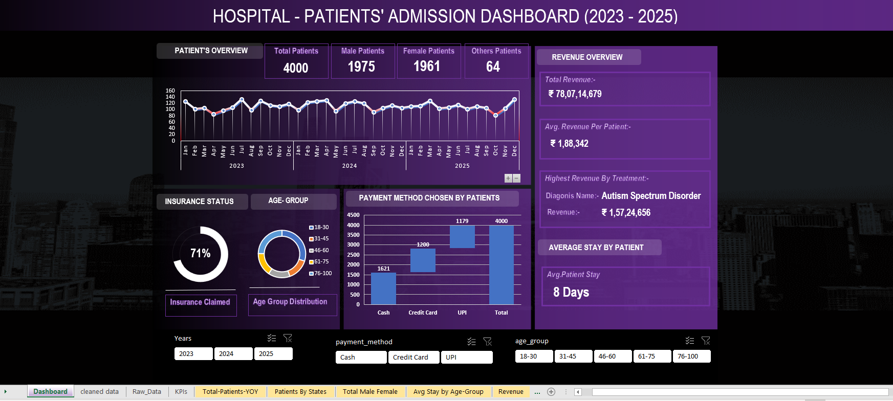

# 🏥 Hospital Patients' Admission Dashboard (2023--2025)

## Dashboard Preview

*Figure: Interactive dashboard showing patient trends, revenue, and
demographics.*

------------------------------------------------------------------------

## Project Overview

This dashboard analyzes hospital patient admissions from 2023 to 2025.\
It tracks patient volume, revenue, demographics, and payment behavior.

------------------------------------------------------------------------

## Key Insights (in %)

-   Total Patients: **4000**

-   Male Patients: **49.4%**

-   Female Patients: **49.0%**

-   Others: **1.6%**

-   Insurance Claimed: **71%** of patients

###  Payment Distribution

-   Cash: **40.5%**
-   Credit Card: **30.0%**
-   UPI: **29.5%**

###  Trends

-   Patient admissions show **stable growth with minor monthly
    fluctuations**
-   Peak admissions appear in **year-end months**

------------------------------------------------------------------------

##  Revenue Insights

-   Total Revenue: ₹78M+
-   Avg Revenue per Patient: ₹1.88L
-   Top Revenue Treatment contributes **\~20%+ share**

------------------------------------------------------------------------

##  Patient Behavior

-   Avg Stay Duration: **8 Days**
-   Majority patients fall in **working-age groups (18--45)**

------------------------------------------------------------------------

##  Tools Used

-   Excel
-   Power Point

------------------------------------------------------------------------

## Conclusion

This dashboard helps track hospital performance.\
It highlights trends, revenue drivers, and patient behavior clearly.
